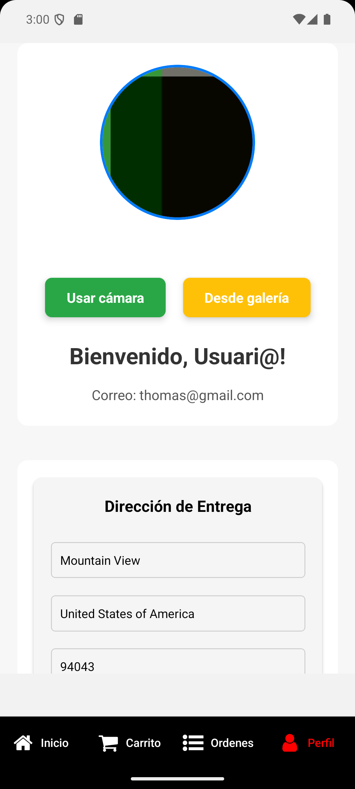
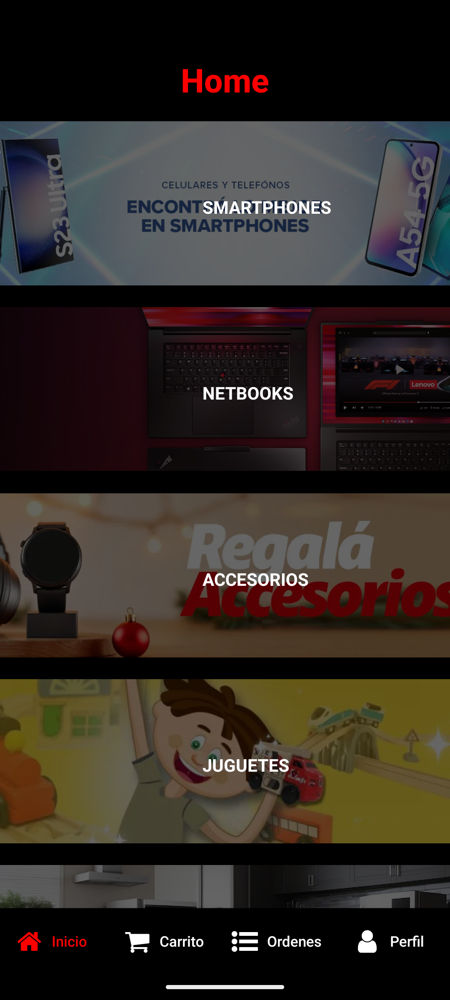

# MiE-commerce

## Descripción

MiE-commerce es una aplicación móvil desarrollada con React Native que permite a los usuarios gestionar su perfil, Hacer compras, Ver su historial de ordenes

## Características

- **Gestión de Perfil**: Los usuarios pueden actualizar su imagen de perfil utilizando la cámara o seleccionando una imagen desde la galería.
- **Almacenamiento Persistente**: Los datos del perfil se guardan utilizando AsyncStorage para asegurar que la información se mantenga incluso en los cierres de sesiones.
- **Selección de Ubicación**: Los usuarios pueden seleccionar y guardar su ubicación.
- **Compras-Orden** Los usuarios pueden realizar sus compras y ver su historial de ordenes.

## Capturas de Pantalla

### Pantalla de Perfil

### Home

